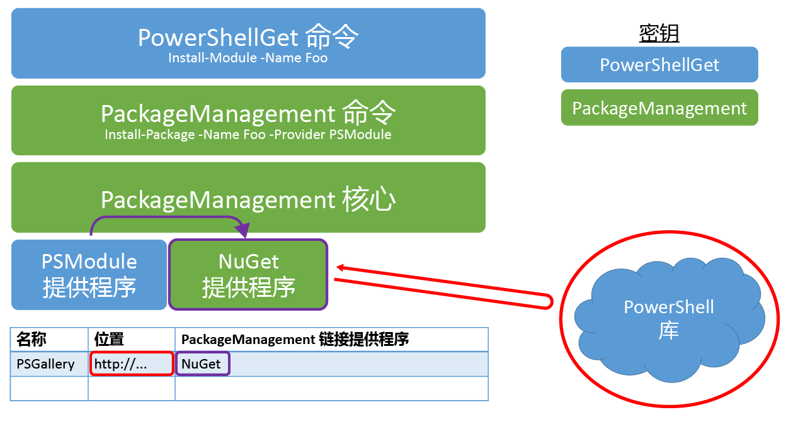

# 常见问题

## PowerShell 模块是什么？

PowerShell 模块是包含某些 PowerShell 功能的可重复使用程序包。 PowerShell 中的所有内容（函数、变量、DSC 资源等）都可打包在模块中。 通常，模块是包含特定路径上存储的特定类型文件的文件夹。 共有几种不同的 PowerShell 模块类型。

## PowerShell 脚本是什么？

PowerShell 脚本是存储在.ps1 文件中的一系列命令，用于启用重用和共享。 PowerShell 工作流也是 PowerShell 脚本，可概述任务组和提供这些任务的序列。 有关详细信息，请访问 [Getting Started with PowerShell Workflow](https://technet.microsoft.com/library/jj134242.aspx)（PowerShell 工作流入门）。

## PowerShell 脚本 与 PowerShell 模块有何不同？

通常模块更适合共享，但我们正启用脚本共享使向社区贡献工作流和脚本变得更加容易。 有关详细信息，请参阅以下博客：

- [不编写脚本，编写 PowerShell 模块](https://blogs.technet.microsoft.com/heyscriptingguy/2011/06/27/dont-write-scripts-write-powershell-modules/)
- [了解 PowerShell 模块](https://blogs.technet.microsoft.com/heyscriptingguy/2015/07/10/understanding-powershell-modules/)

## 如何发布到 PowerShell 库？

必须先在 PowerShell 库中注册帐户，然后才能将包发布到库中。 这是因为发布包需要注册时提供的 NuGetApiKey。 若要注册，请使用个人、工作或学校帐户登录到 PowerShell 库。 第一次登录时需要一次性注册过程。 此后，个人资料页上会提供 NuGetApiKey。

在库中注册后，使用 [Publish-Module][] 或 [Publish-Script][] cmdlet 将包发布到库中。
有关如何运行这些 cmdlet 的详细信息，请访问“发布”选项卡，或阅读 [Publish-Module][] 和 [Publish-Script][] 文档。

安装或保存包无需注册或登录到库。

## 尝试将项发布到 PowerShell 库时，出现“无法处理请求。 ‘指定的 API 密钥无效或无权限访问指定的包。’。 远程服务器返回错误：(403) 已禁止。” 错误。 这是什么意思？

出现该错误的原因可能如下：

- 指定的 API 密钥无效。
     请确保帐户中指定了有效的 API 密钥。 若要获取 API 密钥，请查看个人资料页。
- 指定的包名称不属于你。
     如果已确认 API 密钥正确无误，则可能是因为已存在一个具有与你尝试使用的名称相同的包。 该包可能被其所有者取消列出，在这种情况下，该包不会出现在任何搜索结果中。 若要确定具有相同名称的包已经存在，请打开浏览器并导航至该包的详细信息页：`https://www.powershellgallery.com/packages/<packageName>`。 例如，直接导航至 `https://www.powershellgallery.com/packages/pester` 将进入 Pester 模块的详细信息页上，无论其列出与否。 如果具有冲突名称的包已经存在且被取消列出，则可以执行以下操作：
    - 选择其他包名称。
    - 联系现有包的所有者。

## 为什么昨天可使用个人帐户登录而现在却无法登陆？

请注意库帐户不会适应主电子邮件别名的更改。 有关详细信息，请参阅 [Microsoft 电子邮件别名](https://windows.microsoft.com/windows/outlook/add-alias-account)。

## 为什么选中“包”选项卡上所有“类别”复选框时没有显示所有库包？

选中“类别”复选框即表示“我想查看此类别中所有的包”。 仅会显示所选类别中的包。 同样，选中所有的“类别”复选框即表示“我想查看所有类别中所有的包”。 但库中的一些包不属于所列出的任何类别，因而不会显示在结果中。 若要查看库中的所有包，请取消选中所有类别，或再次选择“包”选项卡。

## 将模块发布到 PowerShell 库中有什么要求？

任何种类的 PowerShell 模块（脚本模块、二进制模块或清单模块）都可发布到库中。
若要发布模块，PowerShellGet 需要了解该模块的版本、说明、作者和许可方式等信息。
从模块清单 (.psd1) 文件或 [Publish-Module][] cmdlet 的 LicenseUri 参数的值的部分发布过程中读取此信息。
所有发布到库中的模块必须具有模块清单。
清单中包含以下信息的任何模块都可发布到库中：

- 版本
- 说明
- 作者
- 一个该模块许可条款的 URI，或作为该清单的 PrivateData 的一部分，或在 [Publish-Module][] cmdlet 的 LicenseUri 参数中。

## 如何创建格式正确的模块清单？

创建模块清单最简单的方法是运行 [New-ModuleManifest][] cmdlet。 PowerShell 5.0 或更高版本中，New-ModuleManifest 会生成格式正确的模块清单，其中包含 **ProjectUri**、**LicenseUri**、**Tags** 等有用元数据的空白字段。 只需填写空值，或使用生成的清单作为正确格式的示例。

若要验证是否已正确填写所有必需的元数据字段，请使用 [Test-ModuleManifest][] cmdlet。

若要更新模块清单文件字段，请使用 [Update-ModuleManifest][] cmdlet。

## 将脚本发布到库中有什么要求？

任何种类的 PowerShell 脚本（脚本或工作流）都可发布到库中。
若要发布脚本，PowerShellGet 需要了解该脚本的版本、说明、作者和许可方式等信息。
从脚本文件的 PSScriptInfo 部分或 [Publish-Script][] cmdlet 的 LicenseUri 参数的值的部分发布过程中读取此信息。
所有发布到库中的脚本必须具有元数据信息。
PSScriptInfo 部分中包括以下信息的任何脚本都可发布到库中：

- 版本
- 说明
- 作者
- 一个该脚本许可条款的 URI，或作为此脚本的 PSScriptInfo 的一部分，或在 [Publish-Script][] cmdlet 的 LicenseUri 参数中。

## 如何搜索？

在文本框中键入要查找的内容。 例如，如要查找与 Azure SQL 相关的模块，只需键入“azure sql”。 搜索引擎会在所有已发布的包（包括标题、说明和元数据）中查找这些关键字。 然后，根据加权质量分，搜索引擎将显示最接近的匹配。 你也可以在以下字段的搜索查询中使用 field:"value" 语法按指定字段进行搜索：

- 标记
- 功能
- Cmdlet
- DscResources
- PowerShellVersion

例如，搜索 PowerShellVersion:"2.0" 时，仅会显示与 PowerShellVersion 2.0 相容（基于其模块/脚本清单）的结果。

## 如何创建格式正确的脚本文件？

创建格式正确的脚本文件最简单的方法是运行 [New-ScriptFileInfo][] cmdlet。 PowerShell 5.0 中，New-ScriptFileInfo 会生成格式正确的脚本文件，其中包含 **ProjectUri**、**LicenseUri**、**Tags** 等有用元数据的空白字段。 只需填写空值，或使用生成的脚本文件作为正确格式的示例。

若要验证是否已正确填写所有必需的元数据字段，请使用 [Test-ScriptFileInfo][] cmdlet。

若要更新脚本元数据字段，请使用 [Update-ScriptFileInfo][] cmdlet。

## 还有哪些其他类型的 PowerShell 模块？

术语 PowerShell 模块也指执行实际功能的文件。 脚本模块文件 (.psm1) 包含 PowerShell 代码。 二进制模块文件 (.dll) 包含已编译的代码。

可这样理解：封装模块的文件夹即是模块文件夹。 模块文件夹包含描述该文件夹内容的模块清单 (.psd1)。 实际完成工作的文件是脚本模块文件 (.psm1) 和二进制模块文件 (.dll)。 DSC 资源位于特定的子文件夹中，并作为脚本模块文件或二进制文件执行。

库中所有模块包含模块清单，且其中大多数模块包含脚本模块文件或二进制模块文件。 由于这些不同的含义，术语模块可能会造成混淆。 除非明确说明，否则此页上所有使用的“模块”一词都指包含这些文件的模块文件夹。

## PackageManagement 与 PowerShellGet 有何关联？ （高级回答）

PackageManagement 是使用任何程序包管理器的一个公共接口。 最后，无论是处理 PowerShell 模块、MSI、Ruby gem、NuGet 包还是 Perl 模块，都可使用 PackageManagement 命令（Find-Package 和 Install-Package）进行查找和安装。 每个插入 PackageManagement 的程序包管理器都具有一个程序包提供程序，因而 PackageManagement 可实现该操作。 提供程序完成所有的实际工作；它们从存储库中提取内容，并本地安装内容。 通常，程序包提供程序环绕处理给定程序包类型的现有程序包管理器工具。

PowerShellGet 是 PowerShell 包的包管理器。
存在一个通过 PackageManagement 揭示 PowerShellGet 功能的 PSModule 程序包提供程序。
因此，可运行 [Install-Module][] 或 Install-Package -Provider PSModule 来从 PowerShell 库安装模块。
特定 PowerShellGet 功能（包括 [Update-Module][] 和 [Publish-Module][]）无法通过 PackageManagement 命令访问。

总之，PowerShellGet 仅侧重于提供优质 PowerShell 内容的程序包管理体验。 PackageManagement 侧重于通过一组工具公开所有的包管理体验。 如对此回答不满意，可在本文档底部的 **PackageManagement 与 PowerShellGet 有何关联？** 部分中查看更详尽的回答。

有关详细信息，请访问 [PackageManagement 项目页](https://oneget.org/)。

## NuGet 与 PowerShellGet 有何关联？

PowerShell 库是 [NuGet Gallery](https://www.nuget.org/)（NuGet 库）的修改版本。 PowerShellGet 使用 NuGet 提供程序支持基于 NuGet 的存储库，例如 PowerShell 库。

可对任何有效的 NuGet 存储库或文件共享使用 PowerShellGet。 只需通过运行 [Register-PSRepository][] cmdlet 添加此存储库。

## 这是否意味着可以使用 NuGet.exe 来处理库？

是的。

## PackageManagement 与 PowerShellGet 有何关联？ （技术细节）

事实上，PowerShellGet 很大程度上利用了 PackageManagement 基础结构。

在 PowerShell cmdlet 层，[Install-Module][] 实际上是 Install-Package -Provider PSModule 的薄包装器。

在 PackageManagement 程序包提供程序层，PSModule 程序包提供程序实际调用到其他 PackageManagement 程序包提供程序。 例如，使用基于 NuGet 的库（例如 PowerShell 库）时，PSModule 程序包提供程序会使用 NuGet 程序包提供程序作用于该存储库。

图 1：PowerShellGet 体系结构

## 运行 PowerShellGet 有什么要求？

通常，建议选取最新版本的 PowerShellGet 模块（请注意其需要.NET 4.5）。

**PowerShellGet** 模块需要 **PowerShell 3.0 或更高版本**。

因此，**PowerShellGet** 需要以下操作系统之一：

- Windows 10
- Windows 8.1 专业版
- Windows 8.1 企业版
- Windows 7 SP1
- Windows Server 2016
- Windows Server 2012 R2
- Windows Server 2008 R2 SP1

**PowerShellGet** 也需要 .NET Framework 4.5 或更高版本。 你可从[此处](https://msdn.microsoft.com/library/5a4x27ek.aspx)安装 .NET Framework 4.5 或更高版本。

## 能否保留将来要发布的包的名称？

不能抢占包名称。 如果认为现有包占用的名称更适合你的包，可尝试[联系包的所有者](./how-to/working-with-packages/contacting-package-owners.md)。 如果数周内未获得回复，可联系支持人员，PowerShell 库团队将进行查看。

## 如何索取包的所有权？

有关详细信息，请查看 PowerShellGallery.com 上的[管理包所有者](./how-to/publishing-packages/managing-package-owners.md)。

## 如何处理违反包许可证的包所有者？

我们鼓励 PowerShell 社区一起解决包所有者之间可能出现的任何争议。  PowerShellGallery.com 管理员进行调解之前，我们希望你遵循我们精心指定的[争议解决过程](./how-to/getting-support/dispute-resolution.md)。

[New-ModuleManifest]: /powershell/module/Microsoft.PowerShell.Core/New-ModuleManifest
[Test-ModuleManifest]: /powershell/module/Microsoft.PowerShell.Core/Test-ModuleManifest
[Update-ModuleManifest]: /powershell/module/Microsoft.PowerShell.Core/Update-ModuleManifest

[Install-Module]: /powershell/module/PowershellGet/Install-Module
[New-ScriptFileInfo]: /powershell/module/PowershellGet/New-ScriptFileInfo
[Publish-Module]: /powershell/module/PowershellGet/Publish-Module
[Publish-Script]: /powershell/module/PowershellGet/Publish-Script
[Register-PSRepository]: /powershell/module/PowershellGet/Register-PSRepository
[Test-ScriptFileInfo]: /powershell/module/PowershellGet/Test-ScriptFileInfo
[Update-Module]: /powershell/module/PowershellGet/Update-Module
[Update-ScriptFileInfo]: /powershell/module/PowershellGet/Update-ScriptFileInfo
